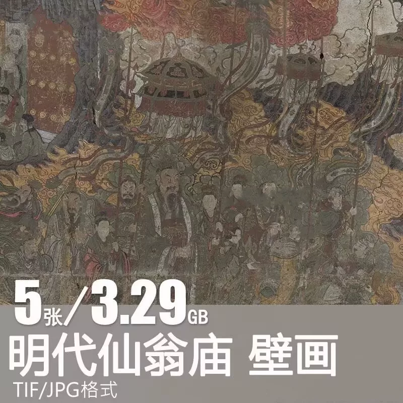
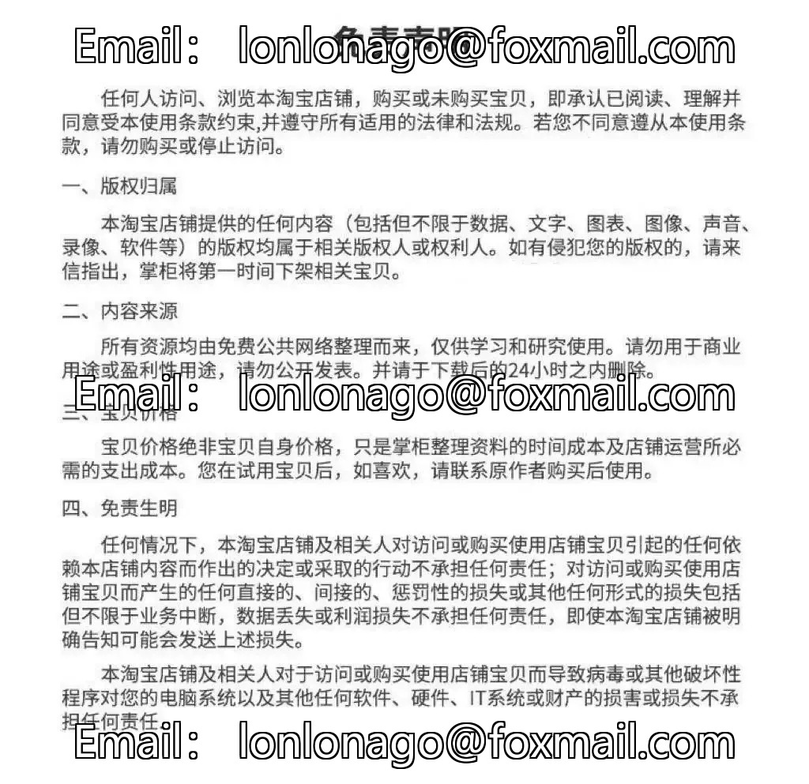

# （Extremely cheap）The Tang Xuanzong's Taishan Palace on the Heavenly Mountain during the reign of Emperor Ming of Yuan Dynasty, in the murals of the Jianying Palace

## Body

（Extremely cheap）Xianweng Temple Ming Dynasty Mural Tang Xuanzong Mount Tai Shrine of pilgrimage and the picture of the journey to the source

(Full product description was not available from the source page.)

## Images

## Payment

Here is a pay link on Stripe ( https://buy.stripe.com/3cs8yP7sY87d0vu9AB ). Please contact me lonlonago@foxmail.com after funding $89, and I will send you a complete data files , thank you!

